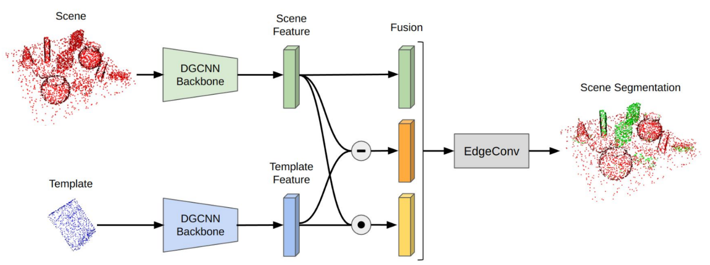

# Find Anything Anywhere All At Once

In this project, we develop a network that can segment intances of a previously unseen object in a point cloud. The network takes as input the scene point cloud and a point cloud
corresponding to the desired object, and predicts which points in the source point cloud belong to instances of the diesired object.



For more details, refer [project poster](https://drive.google.com/file/d/17vEvT2sD1VmM8bkss50KO_Q4bfIDWkF9/view?usp=sharing).

## Training

To train the model, run

```
python -m fa.train --seed 0 --exp_name test_exp --batch_size 16
```